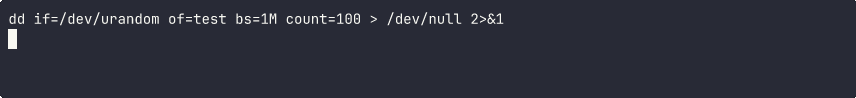
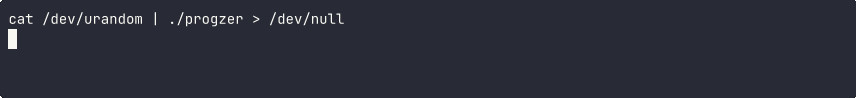

# Progzer - prgz - progress bar cli

[](https://github.com/64mb/progzer/actions/workflows/release.yml)
[](https://github.com/64mb/progzer/actions/workflows/ci.yml)
[](https://github.com/64mb/progzer/actions/workflows/auto-tag.yml)

Progzer is a command-line utility for displaying progress of Unix commands that support pipes, such as `gzip`, `tar`, etc. It reads from stdin and writes to stdout while displaying a progress bar on stderr.

## Demo





## Features

- Displays a progress bar with percentage completion (when total size is known)
- Shows transfer rate in human-readable format (B/s, KB/s, MB/s, GB/s)
- Supports both known and unknown total sizes
- Automatically adapts to terminal width
- Minimal impact on performance
- No external dependencies

## Installation

### Using pre-built binaries

Download the appropriate binary for your platform from the releases page:

- `progzer-linux-amd64` - For Linux x64 systems
- `progzer-linux-arm64` - For Linux ARM64 systems (e.g., Raspberry Pi)
- `progzer-darwin-arm64` - For macOS ARM64 systems (M1/M2 Macs)

All binaries are located in the `dist` directory after building.

Make the binary executable:

```bash
chmod +x dist/progzer-linux-amd64  # Replace with your platform's binary
```

### Building from source

#### Using Task (recommended)

First, install Task if you don't have it already:

```bash
# macOS
brew install go-task

# Linux
sh -c "$(curl --location https://taskfile.dev/install.sh)" -- -d -b ~/.local/bin
```

Then build the project:

```bash
# Clone the repository
git clone https://github.com/yourusername/progzer.git
cd progzer

# Build using Task (produces binaries for all supported architectures in the dist folder)
task

# Or build for current platform only
task build-local

# Build for specific platforms
task build-linux-amd64
task build-linux-arm64
task build-darwin-arm64

# Build for all platforms locally (without Docker)
task build-all-local

# Run tests
task test

# Clean up
task clean
```

#### Using Docker directly

```bash
# Clone the repository
git clone https://github.com/yourusername/progzer.git
cd progzer

# Build using Docker (produces binaries for all supported architectures in the dist folder)
docker build -t progzer-builder .
docker create --name progzer-container progzer-builder
docker cp progzer-container:/app/progzer-linux-amd64 dist/
docker cp progzer-container:/app/progzer-linux-arm64 dist/
docker cp progzer-container:/app/progzer-darwin-arm64 dist/
docker rm progzer-container
```

## Usage

```bash
# Basic usage (indeterminate mode)
command | progzer | destination

# With known size
command | progzer --size=SIZE_IN_BYTES | destination

# Example with gzip
cat large_file.txt | progzer --size=$(stat -c%s large_file.txt) | gzip > large_file.txt.gz

# Example with tar
tar cf - directory | progzer | destination
```

## Options

- `--size=N`: Expected total size in bytes (default: indeterminate)
- `--refresh=DURATION`: Refresh rate for progress updates (default: 100ms)
- `--quiet`: Don't show progress bar
- `--bar-size=N`: Size of the progress bar in characters (default: 34)
- `--version`: Show version information and exit

## Examples

```bash
# Compress a file with gzip and show progress
cat large_file | progzer --size=$(stat -c%s large_file) | gzip > large_file.gz

# Backup a directory with tar and show progress
tar cf - /path/to/directory | progzer | ssh user@remote "cat > backup.tar"

# Download a file with curl and show progress
curl -s http://example.com/large_file | progzer > large_file
```

## CI/CD

This project uses GitHub Actions for continuous integration and deployment:

- **CI Workflow**: Automatically builds and tests the code on every push to the main branch and pull requests.
- **Auto Tag Workflow**: Automatically creates a new version tag on every push to the main branch, incrementing the patch version.
- **Release Workflow**: Automatically builds binaries for all supported platforms and creates a GitHub release when a new tag is pushed.

The CI/CD pipeline is fully automated:

1. When you push to the main branch:
   - The code is built and tested
   - A new version tag is automatically created and pushed
   - This triggers the release workflow

2. The release workflow:
   - Builds binaries for all supported platforms
   - Creates a GitHub release with the binaries attached
   - Builds and pushes Docker images to GitHub Container Registry (ghcr.io)

You can manually create a release by pushing a tag:

```bash
# Tag the release
git tag -a v1.0.0 -m "Release v1.0.0"

# Push the tag
git push origin v1.0.0
```

### Docker Images

Docker images are available from GitHub Container Registry:

```bash
# Pull the latest image
docker pull ghcr.io/64mb/progzer:latest

# Run the container
docker run -i --rm ghcr.io/64mb/progzer
```
## License

Apache License 2.0. See [LICENSE](LICENSE) file for details.